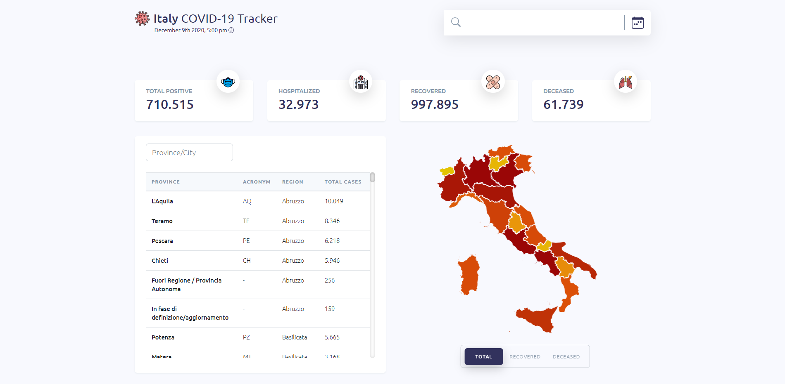
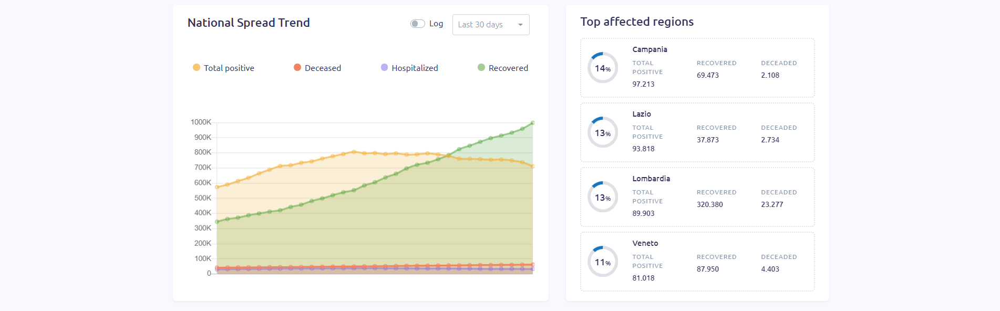

<p align="center">

</p>
<h2 align="center"> Italy COVID-19 tracker</h2>
  <p align="center">
    Interactive and animated dashboard to track the outbreak of COVID-19 in Italy
    <br />
    <a href="https://github.com/veronicadev/italy-covid-tracker"><strong>Explore the docs »</strong></a>
    <br />
    <br />
    <a href="https://github.com/veronicadev/italy-covid-tracker">View Demo</a>
    ·
    <a href="https://github.com/veronicadev/italy-covid-tracker/issues">Report Bug</a>
    ·
    <a href="https://github.com/veronicadev/italy-covid-tracker/issues">Request Feature</a>
  </p>


<!-- TABLE OF CONTENTS -->
## Table of Contents

* [About the Project](#about-the-project)
  * [Built With](#built-with)
* [Getting Started](#getting-started)
  * [Prerequisites](#prerequisites)
  * [Installation](#installation)
* [Features](#features)
* [Roadmap](#roadmap)
* [Contributing](#contributing)
* [Contact](#contact)

 
## About The Project

 


The purpose of this project is to show, in a intuituve and interactive way, data of COVID-19 outbreak in Italy. The dashboard fetches data from the official <a target="_blank" href="https://github.com/pcm-dpc/COVID-19">github repository</a> of Dipartimento della Protezione Civile, and shows it in different ways like tables, charts and map.


### Built With
The dashboard is built with:
* Vue.js
* Node.js
* Express
* Bootstrap Vue
* MapBox


## Getting Started

Follow the instructions for setting up the project locally.

### Prerequisites

* Node
* npm
```sh
npm install npm@latest -g
```

### Installation

1. Clone the repo
```sh
git clone https://github.com/veronicadev/italy-covid-tracker.git
```
3. Install NPM packages
```sh
npm install
```
4. Create the ```.env ``` file in the main folder of the project and enter your API
```.env
DATASOURCE_HOST=https://raw.githubusercontent.com
DATASOURCE_BASE_URL=/pcm-dpc/COVID-19/master
VUE_APP_API_URL=http://localhost
NODE_ENV=development
VUE_APP_MAP_TOKEN=<YOUR MAPBOX KEY>
```
5. Run the following command to start the server
```sh
npm run start
```
5. Run the following command to start vue
```sh
npm run serve
```

## Features

### Search & Calendar

### Province list

### Interactive map

### Interactive national trend chart

### Top affected regions

## Roadmap

See the [open issues](https://github.com/veronicadev/italy-covid-tracker/issues) for a list of proposed features (and known issues).


## Contributing

Contributions are what make the open source community such an amazing place to be learn, inspire, and create. Any contributions you make are **greatly appreciated**.

1. Fork the Project
2. Create your Feature Branch (`git checkout -b feature/AmazingFeature`)
3. Commit your Changes (`git commit -m 'Add some AmazingFeature'`)
4. Push to the Branch (`git push origin feature/AmazingFeature`)
5. Open a Pull Request


## Contact

Project Link: [https://github.com/veronicadev/italy-covid-tracker](https://github.com/veronicadev/italy-covid-tracker)
